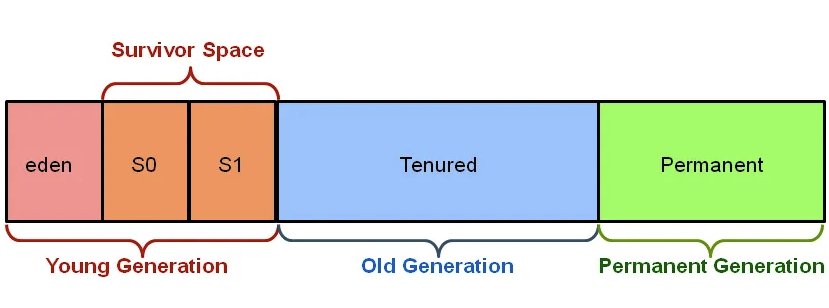
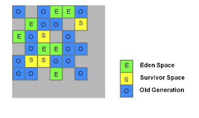
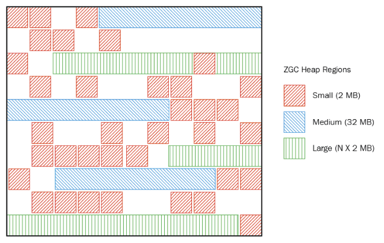

== Java 21 Demo

'''

=== JEP 439. Z Garbage Collector

Z Garbage Collector (ZGC) is a scalable low latency garbage collector introduced as a preview feature in *JDK 11.* +
It is a GC written from scratch, and it became available for production use in *JDK 15.* +
Has now been promoted from "Targeted" to "Completed" status in *JDK 21.*

ZGC performs all expensive work concurrently, without stopping the execution  of the application threads for more than 1ms, _(10ms in JDK 11!!!)_ which makes it suitable for applications which require low latency and/or use a very large heap (multi-terabytes).

When introduced, *ZGC was Non-Generational* and used multi-mapped memory as older garbage collectors did, to reduce the overhead of load barriers, but it does organize the address space more efficiently un ZPages of various sizes.

*Generational ZGC* maintains separate generations for young (recently allocated objects) and old objects (long-lived objects). Both generations are collected independently, focusing on quickly collecting younger objects. This allows ZGC to collect young objects — which tend to die young — more frequently.

Generational ZGC follows several design principles to ensure low latency and high scalability:

* *No Multi-Mapped Memory*: Instead of using multi-mapped memory as older garbage collectors did, Generational ZGC employs explicit code in load and store barriers. This approach allows for more metadata bits in colored pointers and the potential expansion of the maximum heap size beyond the 16-terabyte limit of non-generational ZGC.
* *Optimized Barriers:* ZGC uses highly optimized store+load barriers to maximize throughput. These barriers include Fast-Path (checks if additional work is needed before the referenced object is used) and Slow-Path (performs additional work if needed). For objects in the old generation referencing objects in the young generation, remembered sets are used to streamline the process.
* *Double-Buffered Remembered Sets and Relocations*: Generational ZGC divides memory relocation into two passes: marking and relocation. This approach allows for relocation without consuming a portion of the heap memory.
* *Dense Heap Regions:* Generational ZGC recognizes densely populated regions in the young generation. These regions are marked as dense and not evacuated promptly, saving resources.
* *Large Objects:* Large objects are initially placed in the young generation. If they have short lifespans, they are collected with the young generation. Otherwise, they are promoted to the old generation.
* *Concurrent Garbage Collections:* Young-generation collection can run concurrently with the old-generation marking phase.

NOTE: At its core, ZGC is a concurrent garbage collector, meaning all heavy lifting work is done while *Java threads continue to execute*.

* Starting from JDK 17, ZGC dynamically scales up and down the number of concurrent GC threads.
* The log is way richer in details.
* ZGC is NUMA-aware, which essentially means that it has a NUMA-aware memory allocator. _(Non-Uniform Memory Access)_ By default, NUMA support is enabled for ZGC. However, if the JVM realizes that it is bound to a subset in the JVM, this feature can be disabled.

IMPORTANT: Non-uniform memory access (NUMA) is a way of configuring a cluster of microprocessors into a multiprocessing system, so that memory can be shared locally and performance can be improved and the system’s ability extended.

* ZGC is a single-generation GC. It also supports partial compaction. ZGC is also highly performant when it comes to reclaiming memory and reallocating it.

==== Old style GC heap allocation (before Java 8)

==== G1GC heap allocation (starting with Java 8)

Region sizes are not changeable and must be a power of two between 1MB - 32MB, inclusive. Can be explicitly changed with `-XX:G1HeapRegionSize=#m`

==== ZGC heap allocation (starting with Java 11)

ZGC divides memory into regions, also called *ZPages*. ZPages can be dynamically created and destroyed. ZGC heap can have multiple occurrences of these heap regions.  These can also be dynamically sized (unlike the G1 GC), which are multiples of 2 MB. Here are the size groups of heap regions.

* Small (2 MB)
* Medium (32 MB)
* Large (N * 2 MB)

Unlike other GCs, the physical heap regions of ZGC can map into a bigger heap address space (which can include virtual memory). This can be crucial to combat memory fragmentation issues. Imagine that the user can allocate a really big object in memory, but can’t do so due to unavailability of contiguous space in memory.

This often leads to multiple GC cycles to free up enough contiguous space. If none are available, even after (multiple) GC cycle(s), the JVM will shut down with `OutOfMemoryError`. However, this particular use case is not an issue with the ZGC. Since the physical memory maps to a bigger address space, locating a bigger contiguous space is feasible.

Let's give it try by running this class: link:/Users/iuliana/.work-mine/jdk21-parent-project/child-two-project/src/main/java/org/mytoys/MemoryConsumptionDemo.java[MemoryConsumptionDemo.java]

[source]
----
mvn # build the jars

java -jar -XX:+UseZGC -Xms4G -Xmx16G -XX:ConcGCThreads=20 -Xlog:gc\*:gc-non-generational.log child-two-project/target/child-two-project-2.0-SNAPSHOT.jar
# Execution time: 13015 ms - non-generational

# we know we are not discarding references until the end of execution, but it barely makes any difference, because non-generational ZGC resized the ZPages to fit its needs
# might be quicker because it is good at organizing its young objects and avoiding the heavy job of compacting the heap

java -jar -XX:+UseZGC -Xms16G -Xmx16G -XX:ConcGCThreads=20 -Xlog:gc\*:gc-non-generational.log child-two-project/target/child-two-project-2.0-SNAPSHOT.jar
# Execution time: 13989 ms
# ------------------------------------------------------------------

java -jar -XX:+ZGenerational -XX:+UseZGC -Xms4G -Xmx16G -XX:ConcGCThreads=20 -Xlog:gc\*:gc-generational.log child-two-project/target/child-two-project-2.0-SNAPSHOT.jar
# Execution time: 16564 ms - generational

# we know we are not discarding references until the end of execution,but it makes no difference to the generational one
java -jar -XX:+ZGenerational -XX:+UseZGC -Xms16G -Xmx16G -XX:ConcGCThreads=20 -Xlog:gc\*:gc-generational.log child-two-project/target/child-two-project-2.0-SNAPSHOT.jar
# Execution time: 17145 ms
----

NOTE: Look for terms `workers` and `pages` in the log.

Compare it with Parallel GC from JDK 8: link:/Users/iuliana/.work-mine/jdk8-gc-test/jdk8-gc-test[jdk8-gc-test]

[source]
----
# open new terminal
cd /Users/iuliana/.work-mine/jdk8-gc-test/jdk8-gc-test
mvn

java -jar -Xms4G -Xmx16G  -XX:+PrintGCDetails -Xloggc:/Users/iuliana/.work-mine/jdk21-parent-project/gc-slow.log target/jdk8-gc-test-1.0-SNAPSHOT.jar
# Execution time: 53803 ms

# we know we are not discarding references until the end of execution, so let's allow GC to have a big YG memory
java -jar -Xms16G -Xmx16G  -XX:+PrintGCDetails -Xloggc:/Users/iuliana/.work-mine/jdk21-parent-project/gc-slow.log target/jdk8-gc-test-1.0-SNAPSHOT.jar
# Execution time: 18077 ms
----

In a future release *the Generational ZGC  will become the default*, at which point `-XX:-ZGenerational` will select non-generational ZGC, and even further in the future this will be removed.

IMPORTANT: Bigger is better, want smaller pauses, give it more memory.

IMPORTANT: ZGC -> single-generational initially or non-generational. (ZGC with generations -> 75% less memory, but with the same results.) Well... not really.