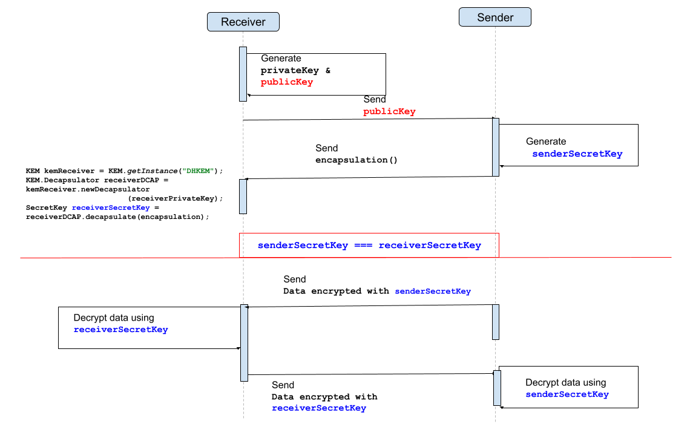

== Java 21 Demo

'''

=== JEP 452. Key Encapsulation Mechanism API

Java21 introduces Key Encapsulation Mechanisms (KEMs), as the preferred approach to Authenticated Key Exchanges (AKE) within Public Key Encryption (PKE) schemes.

In the older key exchange algorithm, the sender encrypts the message using their private key, and the receiver decrypts it with the sender's publicly available key. However, this approach is no longer considered secure, as *quantum computers can compromise most key exchange algorithms*, rendering AKEs vulnerable.

In the KEM scheme, in addition to the public-private key pair, the sender and receiver mutually agree upon an additional "secret value". The sender then transmits this "secret value" to the receiver in an encrypted form. Only the receiver possesses the capability to decrypt this "secret value" and put it to use.

Here's a breakdown of the KEM process: The sender initially leverages the public key and an encryption function to invoke the key encapsulation, which subsequently yields a secret key (referred to as K) and a key encapsulation message (termed ciphertext in ISO 18033-2). The sender then dispatches this key encapsulation message to the receiver. On the receiver's side, they acquire this encapsulated data and apply a key decapsulation function employing their private key along with the received key encapsulation message. This process unveils the secret key K, which the receiver employs to decrypt further messages.

In essence, an additional "secret value" is exchanged between the two parties alongside the PKEs, bolstering the security of the process. Previously, support for KEMs was primarily provided by third-party providers such as link:https://www.bouncycastle.org[BouncyCastle]. However, Java now offers a standardized mechanism for KEMs as well.

Te `javax.crypto.KEM` class provides the functionality of a Key Encapsulation Mechanism (KEM). A KEM can be used to secure symmetric keys using asymmetric or public key cryptography between two parties.

The KEM API consists of three functions:

-> a key pair generation function, (the old KeyPairGenerator API was kept)

-> a key encapsulation function,

-> and a key decapsulation function.

Let's give it try by running this class: link:/Users/iuliana/.work-mine/jdk21-parent-project/child-one-project/src/test/java/org/mytoys/one/KeyEncapsulationTest.java[KeyEncapsulationTest#testKEM]